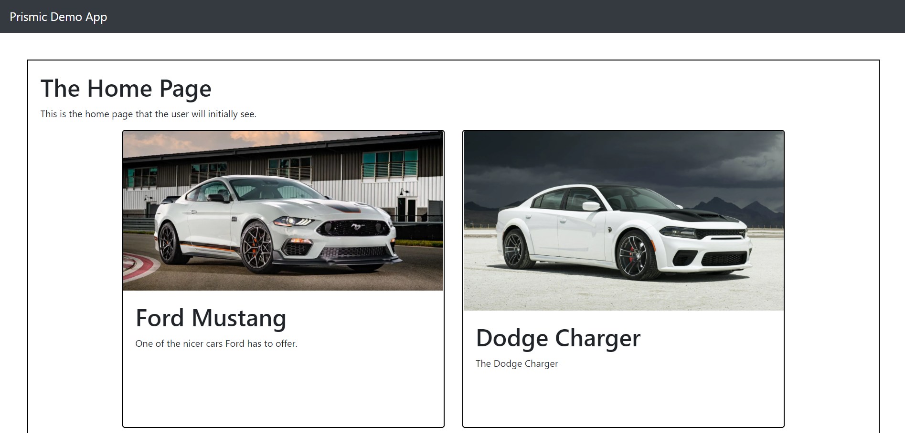

# Prismic Demo App

This is a ReactJS demo app that demonstrates using a Prismic API. This application gathers data from Prismic and uses it to display a list of cars on the page. Cars can be created, edited, or deleted on my Prismic account.

Link: https://prismic-demo-app.herokuapp.com/

## Usage

To use, run the following command:

```
npm start
```

## Dependancies

This app uses the following dependancies:
- React
- prismic-reactjs
- @prismicio/client


